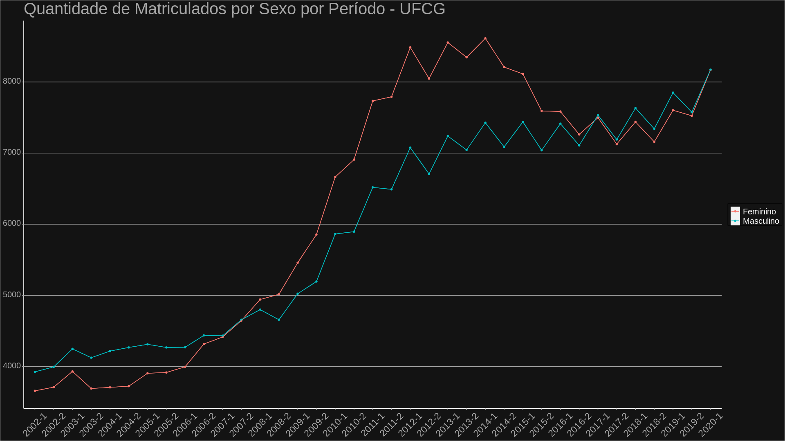

# Análise de Dados da UFCG
Projeto iniciado por estudantes da UFCG com intuito de mostrar dados sobre a instituição de forma clara e intuitiva.
https://portal.ufcg.edu.br/ultimas-noticias/2127-projeto-de-alunos-da-ufcg-converte-informacoes-da-instituicao-em-dados-estatisticos.html

### Integrantes:
**Yohan Lopes** | **yohanhxh@gmail.com**
--- | ---
**Leonardo Veiga** | **leonardo.porfirio@ccc.ufcg.edu.br**

### Alguns gráficos feitos:

**Matrículas por sexo:**

**Alunos ativos, preenchido com vagas ociosas, em todos os campus (2019):**

**Taxa de reprovação nas engenharias:**

